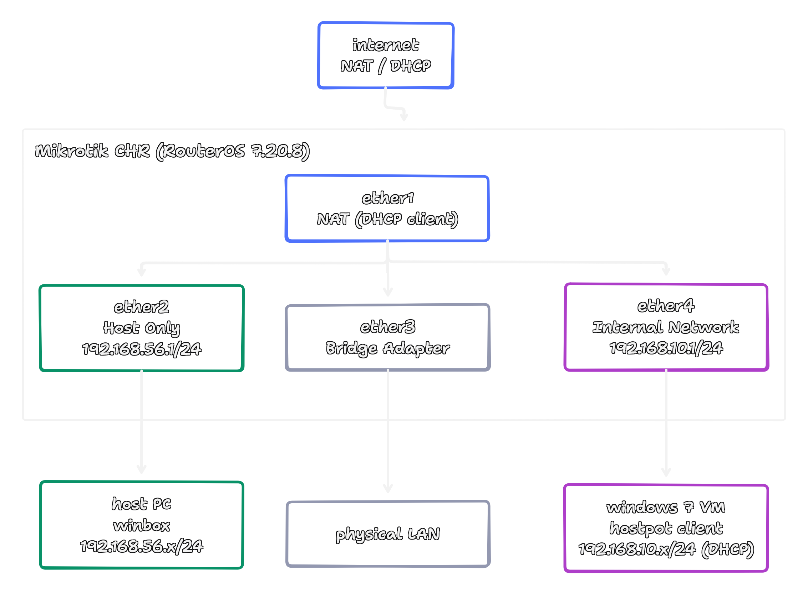
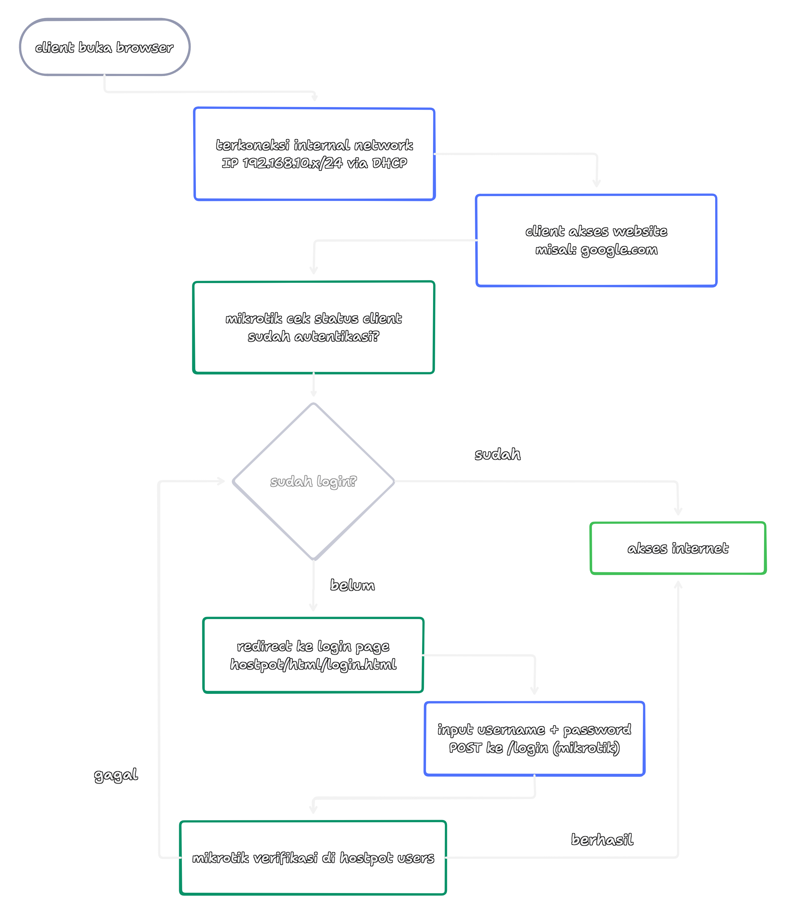

# MikroTik Hotspot Voucher

A simple MikroTik hotspot project using a VirtualBox virtual machine (VM), designed for testing and learning WiFi voucher authentication. It includes a MikroTik CHR VM as a hotspot/router and a Windows 7 VM as a client. The setup uses multiple network adapters (NAT, Host-Only, Bridge, Internal) to simulate internet access and an isolated hotspot network.

---

## Project Overview

The purpose is to:

- Simulate a WiFi hotspot with **voucher-based login**.
- Provide a **customizable login page** for hotspot authentication.
- Document network configurations and settings for small-scale learning environments.

---

## Topology & Flowchart

  

  

---

1. Clone this repository to your local machine.  
2. Follow the setup guide in `docs/setup-guide.md` to configure the VM and MikroTik hotspot.  
3. All required tools are listed in `docs/requirements.md` 
4. Use the `configs/` folder to restore the previously defined MikroTik configuration and voucher users.  
5. Customize the login page in `hotspot/html/` if desired.  
6. Test the hotspot by connecting a Windows 7 client via an internal network adapter.

---

## © 2026 Farell Kurniawan

Copyright © 2026 Farell Kurniawan. All rights reserved.  
Distribution and use of this code is permitted under the terms of the **MIT** license.
