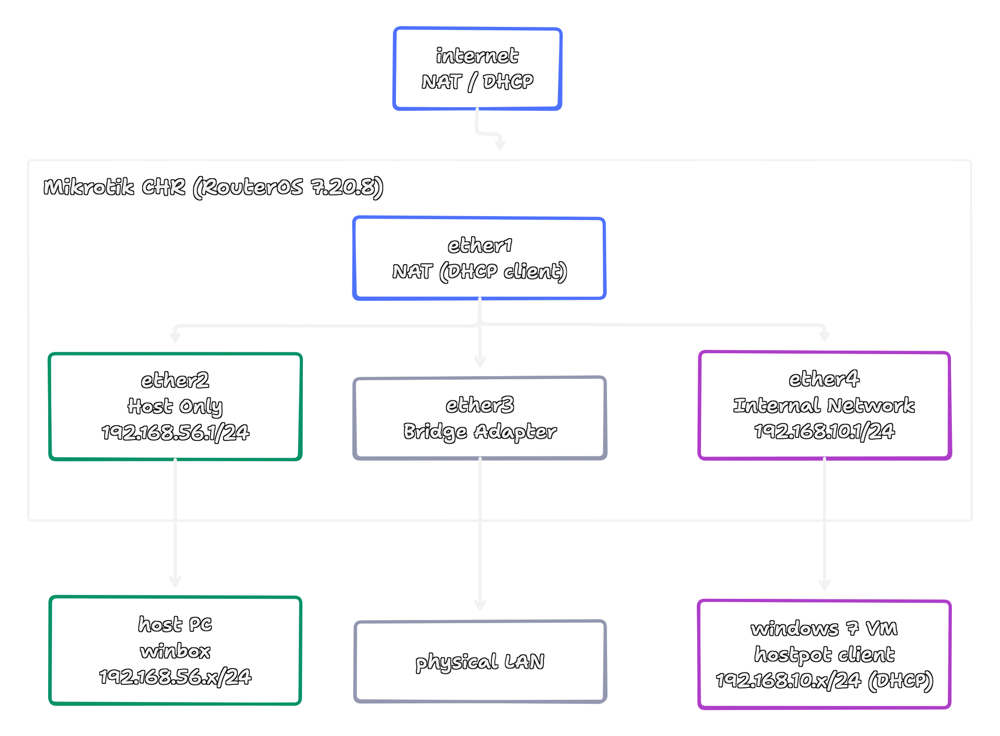
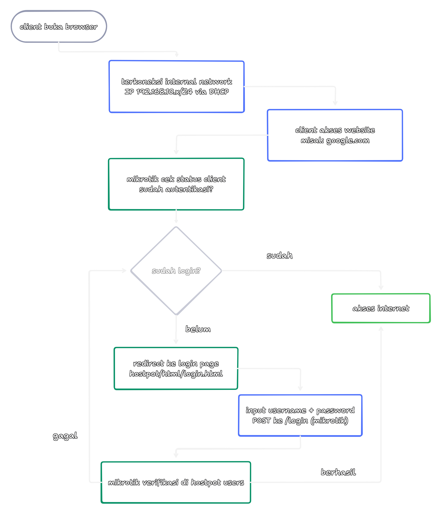

# MikroTik Hotspot Voucher

A MikroTik hotspot project using a VirtualBox virtual machine (VM). It includes a MikroTik CHR VM as a hotspot/router and a Windows 7 VM as a client. The setup uses multiple network adapters (NAT, Host-Only, Bridge, Internal).

Topology

Flowchart

---

1. Clone this repository.
2. Follow the setup guide in [here](docs/setup-guide.md). 
3. All required tools are listed in [here](docs/requirements.md). 
4. Use the [configs/](configs/) folder to restore the previously defined MikroTik configuration and voucher users.  
5. Customize the login page in [here](hotspot/html/)if desired.  
6. Test the hotspot by connecting a Windows 7 client via an internal network adapter.
